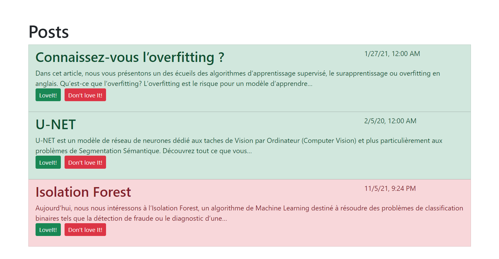

# Partie 2 Activite 1 Angular Openclasseroom

## Description de l'exercice
Nous allons créer une application simple de type blog.  Cette application va afficher les posts du blog, et chaque post aura un bouton permettant de "love it" ou de "don't love it".  Chaque post aura la forme suivante : 

## Technologies utilisé dans cet exercice

* Angular
* Bootstrap
* Jquery

## La structure de l'exercice

* votre AppComponent contiendra l'array des posts, et il le passera à un component **PostListComponent**

* votre PostListComponent affichera un PostListItemComponent pour chaque post dans l'array qu'il a reçu

* chaque **PostListItemComponent** affichera le titre, le contenu et la date de création du post dans le template

* les **PostListItemComponent** auront des boutons qui permettent d'augmenter et de diminuer le nombre de loveIts — cette modification aura uniquement un effet sur le component, et n'a pas besoin d'être remontée au component parent

## Quelques astuces

* Pensez aux différents types de databinding — comment passer des données d'un component à un autre, comment afficher des données dans le template et comment réagir à un événement venant du template

* Pensez aux directives structurelles comme  <code>*ngFor</code>  , et également aux directives par attribut comme  <code>ngClass</code>

* Pensez aux **Pipes** pour la transformation de données, notamment pour la date

## Aperçu finale de l'exercice

